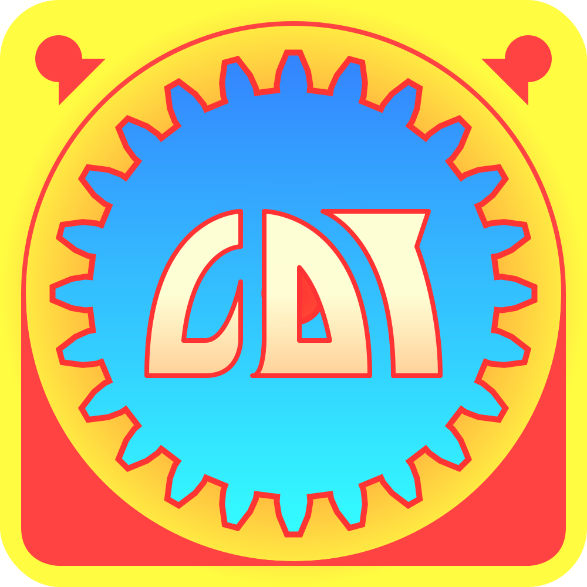
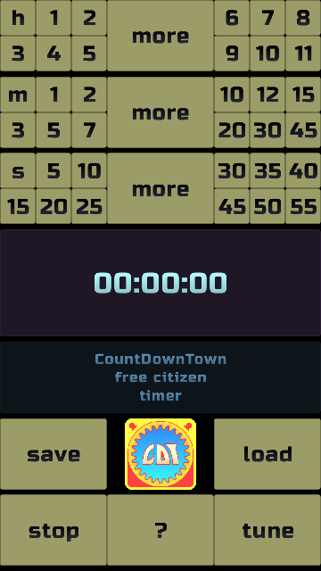
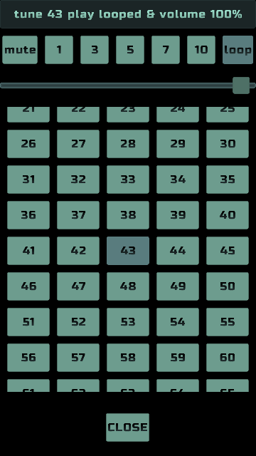

# CountDownTown
Countdown timer gui app, based on crossplatform libgdx framework, using kotlin.  

[Web version](https://healingdrawing.github.io/teavm/cdt) teavm based.  

[Desktop releases](https://github.com/healingdrawing/count-down-town/releases) `.jar`.  

---
Save/load functionality with several repeatable tunes.  

---
Volume control, using gui.  

